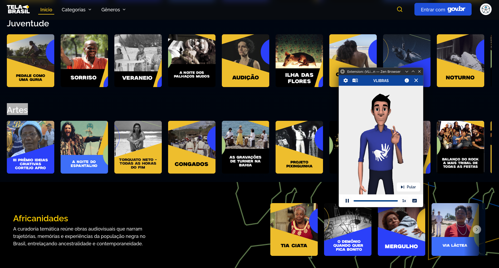
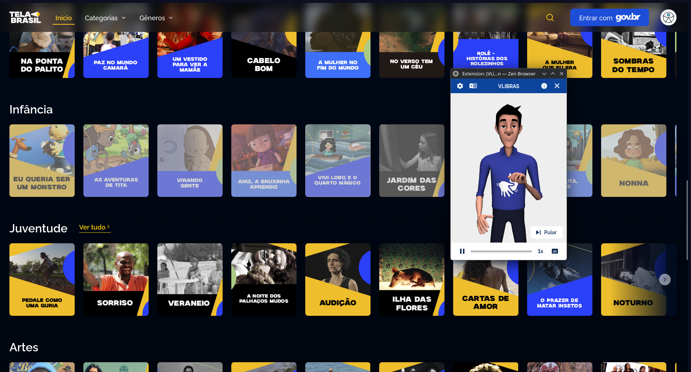
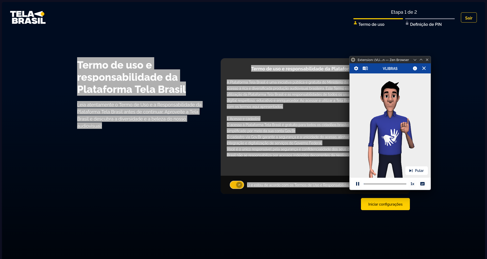
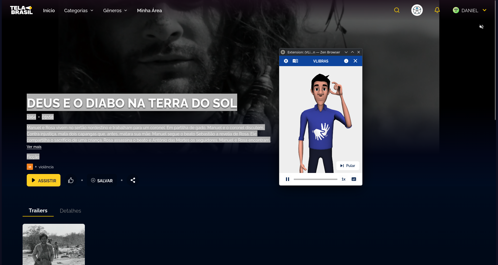

# VLibras

O VLibras é um conjunto de ferramentas gratuitas desenvolvido pela Universidade Federal da Paraíba (UFPB) em parceria com o Ministério da Gestão e da Inovação em Serviços Públicos. Sua finalidade é traduzir conteúdos digitais em português para a **Língua Brasileira de Sinais (Libras)**, tornando sites e aplicações mais acessíveis para pessoas surdas ou com deficiência auditiva. Está disponível como extensão de navegador e como widget embarcável em páginas web.

## Como Usar

1. Instalar a extensão **VLibras** na Chrome Web Store ou Firefox Add-ons.
2. Acessar o site Tela Brasil (`https://telabrasil.cultura.gov.br/`).
3. Clicar no ícone do VLibras na barra do navegador para ativar o widget.
4. O avatar 3D (intérprete virtual) aparecerá na tela e iniciará a tradução do conteúdo da página para Libras.
5. Navegar pelas páginas do site (home, detalhes de filme, termos de uso) para verificar o comportamento da tradução em diferentes contextos.

## Resultado obtido

A avaliação foi realizada utilizando a extensão VLibras nas principais páginas do site Tela Brasil.

**Página inicial — widget ativo traduzindo o conteúdo:**

**Página de termos de uso — avatar traduzindo texto longo:**

**Página de detalhe de filme — widget ativo:**

## Limitação da Avaliação

A avaliação com o VLibras apresenta uma limitação metodológica relevante: **a verificação da qualidade e corretude das traduções para Libras requer conhecimento da língua de sinais**, o que está fora do escopo desta análise. O que foi possível observar e registrar são os aspectos técnicos e funcionais da ferramenta — se o widget carrega, se o avatar é ativado e se a sinalização é iniciada. A precisão linguística da tradução não pôde ser atestada pelos avaliadores.

## Pontos Positivos

* **Compatibilidade com o site:** A extensão VLibras carregou sem erros em todas as páginas testadas do Tela Brasil — homepage, página de filme e termos de uso — sem conflitos com o layout ou scripts da página.
* **Avatar ativado e sinalização iniciada:** O intérprete virtual 3D aparece corretamente e inicia a sinalização ao ser ativado, indicando que a ferramenta consegue processar o conteúdo textual da página.
* **Funcionamento em múltiplos contextos:** A extensão respondeu tanto em páginas de navegação de conteúdo quanto em páginas com texto extenso, como os termos de uso da plataforma.
* **Widget não intrusivo:** O painel pode ser aberto e fechado pelo usuário sem interferir na navegação principal do site.

## Problemas encontrados

* **Widget não embarcado nativamente:** O site Tela Brasil não possui o widget VLibras integrado ao próprio código da página. Por ser um site governamental, a incorporação nativa é recomendada pelo e-MAG para que o usuário não precise instalar nenhuma extensão para ter acesso à tradução em Libras.
* **Grande volume de imagens sem descrição textual:** O site é predominantemente visual, com muitos thumbnails de filmes, banners e imagens promocionais. Sem texto alternativo adequado nesses elementos, o VLibras não tem conteúdo para traduzir, deixando parte significativa da página inacessível em Libras.
* **Vídeos sem janela de Libras nativa:** Os vídeos da plataforma não possuem janela de Libras incorporada (intérprete humano em vídeo), o que limita a acessibilidade para usuários surdos diretamente no conteúdo audiovisual principal do site.

## Acessar o site

> Tela Brasil:
[https://telabrasil.cultura.gov.br/](https://telabrasil.cultura.gov.br/)
