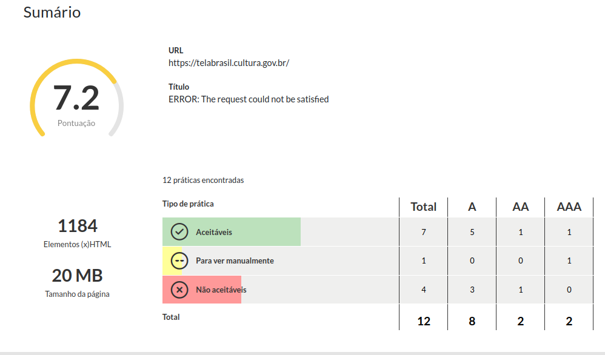

# Access Monitor Plus

O Access Monitor Plus (AMP) é uma ferramenta automatizada utilizada para avaliar e monitorar o nível de acessibilidade digital de sites e páginas web. Ele analisa os códigos para verificar se estão de acordo com as diretrizes internacionais de acessibilidade (WCAG)

## Como Usar

1. Acessar site https://accessmonitor.acessibilidade.gov.pt/results/https%3A%2F%2Ftelabrasil.cultura.gov.br%2F
2. Colar o link do site Tela Brasil.
3. Aguardar a geração do relatório.

## Resultados

Abaixo está o resultado da análise de acessibilidade do site Tela Brasil utilizando o Access Monitor Plus:

| Tipo de Prática | Total | A | AA | AAA |
|----------------|-------|---|----|-----|
| Aceitáveis | 7 | 5 | 1 | 1 |
| Para ver manualmente | 1 | 0 | 0 | 1 |
| Não aceitáveis | 4 | 3 | 1 | 0 |
| **Total** | **12** | **8** | **2** | **2** |

- **Pontuação:** 7.2 / 10
- **Elementos (x)HTML:** 1184
- **Tamanho da página:** 20 MB

## Pontos Positivos 

* **Contraste de cores adequado**: A ferramenta identificou 3 combinações de cores que cumprem o rácio mínimo de contraste exigido pela WCAG (3:1 para texto grande e 4,5:1 para texto normal).
* **Elementos semânticos corretos:**: Todos  elementos com papel semântico que conferem papel decorativo aos descendentes não têm descendentes focáveis.
*  **Cabeçalhos com nome acessível:** Todos os cabeçalhos da página têm nome acessível.
* **Cabeçalhos acessíveis**:Todos os  cabeçalhos foram identificados com nome acessíveis.
* **Estrutura de cabeçalhos:**:Foram identificados examente um cabeçalho  com nível 1,indentificando uma boa hierarquia. 
* **Sem Elementos obsoletos**:Não há elementos obsoletos usados para controle visual da apresentação.
* **Cores com contraste otimizado**:a ferramenta verificou que todas as cores tem uma relação de contraste superior ao rácio de contraste otimizado sugerido pela WCAG.
* **Títulos corretos**: Foi encontrado um título na página e ele está correto.

## Problemas encontrados

Durante a avaliação  de acessibilidade, foram identificadas as seguintes inconformidades em relação às diretrizes da WCAG 2.2:

* **Ausência de link no topo da página**: A página nao links que permita que permita saltar para o conteúdo princiapl da mesma.
* **Ausência de links para saltar blocos de texto**:É necessário verificar manualmente se os links encontrados proporcionam saltos de conteúdo adequados, e se estão sempre visíveis ou ficam visíveis ao receberem foco via teclado (WCAG nível A).
* **Ausência de links para páginas relacionadas**:A natureza da Web é disponibilizar 
nas páginas links para outras páginas relacionadas , permitindo aos utilizadores navegar pelas informações.Uma página Web sem links é, à priori ,uma indicativo de problema.
* **Atributo lang ausente**: O atributo de idioma lang está em falta no HTML, 
o que impede que leitores de tela identifiquem corretamente o idioma da página (WCAG nível A).

## Acessar o site 

> Tela Brasil: 
[https://www.gov.br/cultura/pt-br/assuntos/cinema-do-brasil/difusao/tela-brasil](https://www.gov.br/cultura/pt-br/assuntos/cinema-do-brasil/difusao/tela-brasil)
 