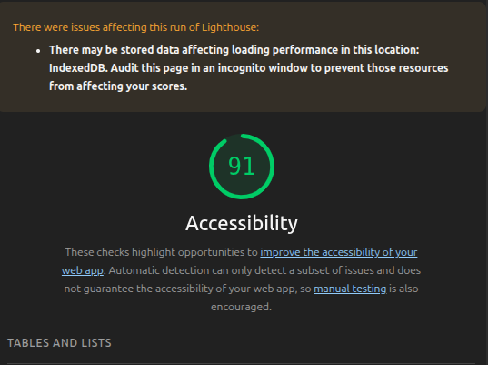

# Lighthouse

  È uma ferramenta automatizada e de código aberto criada pelo Google baseada na WCAG 2.0 e 2.1 .Ela serve para auditar e melhorar a qualidade técnica de páginas da web, gerando uma nota de 0 a 100 em quatro pilares principais: Performance, Acessibilidade, Boas Práticas e SEO.

## Como Usar

1. Abrir o site Tela Brasil
2. Pressionar F12.
3. Selecionar a aba Lighthouse.
4. Marcar a categoria Accessibility.
5. Clicar em Analyze page load.
6. Aguardar a geração do relatório.

## Resultado obtido

 A ferramenta Lighthouse foi executada atingindo 91/100

## Pontos Positivos 

* Interface visual clara e de fácil compreensão, mesmo para usuários iniciantes.
* Organização consistente dos elementos, facilitando a navegação pela página.
* Uso de padrões baseados na WCAG, contribuindo para uma interface mais acessível.

## Problemas encontrados

Durante a avaliação de acessibilidade de acessibilidade, foram identificadas as seguintes inconformidades em relação às diretrizes da WCAG 2.2:

* **Elementos de toque sem tamanho ou espaçamento suficiente:** Algumas áreas clicáveis 
 não possuem o dimensionamento adequado, o que dificulta a navegação porque em dispositivos móveis.
* **Título principal sem texto:** Existe um cabeçalho no código que está totalmente vazio. impede que usuários de leitores de tela acessem informações sobre a estrutura da página. 
* **Erro na organização de Listas :** O menu de bolinhas do carrossel de imagens foi construído de um jeito que quebra as regras do código da página. Isso faz com que os leitores de tela não consigam entender que aquilo é uma lista de slides, deixando a navegação confusa para quem tem deficiência visual.
* **Erro na organização dos Título:** A página não segue uma ordem lógica de cabeçalhos (h1, h2, h3...).Essa bagunça na ordem prejudica a estrutura do conteúdo por leitores de tela, pois a pessoa não consegue entender qual parte do texto é mais importante.

## Acessar o site 

> Tela Brasil: 
[https://www.gov.br/cultura/pt-br/assuntos/cinema-do-brasil/difusao/tela-brasil](https://www.gov.br/cultura/pt-br/assuntos/cinema-do-brasil/difusao/tela-brasil)