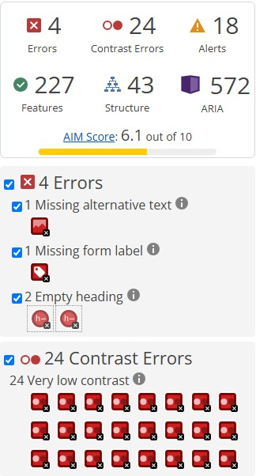
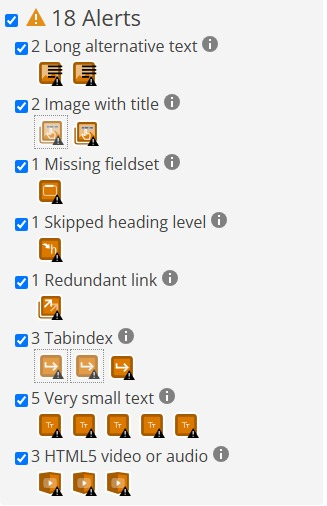

# WAVE

O WAVE (Web Accessibility Evaluation Tool) é uma ferramenta gratuita desenvolvida pela WebAIM para avaliação de acessibilidade web. Ao ser executada, insere ícones visuais diretamente na página analisada, sinalizando erros, alertas, recursos de acessibilidade, elementos estruturais e problemas de contraste.

## Como Usar

1. Instalar a extensão **WAVE Evaluation Tool** na Chrome Web Store.
2. Acessar o site Tela Brasil (telabrasil.cultura.gov.br).
3. Clicar no ícone da extensão WAVE na barra do navegador.
4. O painel lateral será aberto com o resumo dos achados.
5. Clicar em cada ícone na página para ver detalhes do problema e o critério WCAG violado.
6. Utilizar a aba **Contrast** para verificar razões de contraste específicas.

## Resultado obtido

A ferramenta WAVE foi executada sobre a página principal do site Tela Brasil, obtendo a pontuação **AIM Score: 6.1 / 10**.

| Categoria | Quantidade |
|---|---|
| Erros | 4 |
| Erros de contraste | 24 |
| Alertas | 18 |
| Recursos de acessibilidade | 227 |
| Estrutura | 43 |
| ARIA | 572 |

## Pontos Positivos

* **206 imagens com texto alternativo:** A grande maioria das imagens possui atributo `alt` descritivo, e 17 imagens decorativas utilizam `alt` vazio corretamente (WCAG 1.1.1).
* **Landmarks semânticos completos:** A página possui Header, Navigation, Main content e Footer, permitindo navegação eficiente por leitores de tela (WCAG 1.3.1).
* **Uso extensivo de ARIA:** 572 atributos ARIA utilizados, incluindo roles, labels, live regions e estados como `aria-expanded`, demonstrando implementação robusta de acessibilidade (WCAG 4.1.2).
* **Atributo lang definido:** O HTML possui `lang="pt-BR"` configurado corretamente (WCAG 3.1.1).

## Problemas encontrados

Durante a avaliação de acessibilidade com o WAVE, foram identificadas as seguintes inconformidades:

* **1 imagem sem texto alternativo e 1 campo sem rótulo:** Uma imagem de conteúdo não possui `alt` e um campo de formulário não possui label associado, prejudicando a navegação por tecnologias assistivas (WCAG 1.1.1 / 1.3.1).
* **2 cabeçalhos vazios:** Dois elementos de cabeçalho estão sem conteúdo textual, gerando confusão na estrutura da página para leitores de tela (WCAG 1.3.1).
* **Hierarquia de cabeçalhos quebrada:** A página possui 11 elementos `<h1>` (quando deveria ter apenas 1) e 10 `<h3>`, sem nenhum `<h2>`, quebrando a hierarquia lógica (WCAG 1.3.1).
* **24 erros de contraste:** Foram identificados 24 elementos com contraste muito baixo entre texto e fundo, dificultando a leitura para usuários com baixa visão (WCAG 1.4.3).
* **5 textos muito pequenos:** Elementos com texto em tamanho reduzido que pode dificultar a leitura (WCAG 1.4.4).

## Acessar o site

> Tela Brasil:
[https://telabrasil.cultura.gov.br/](https://telabrasil.cultura.gov.br/)